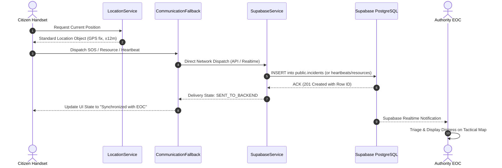
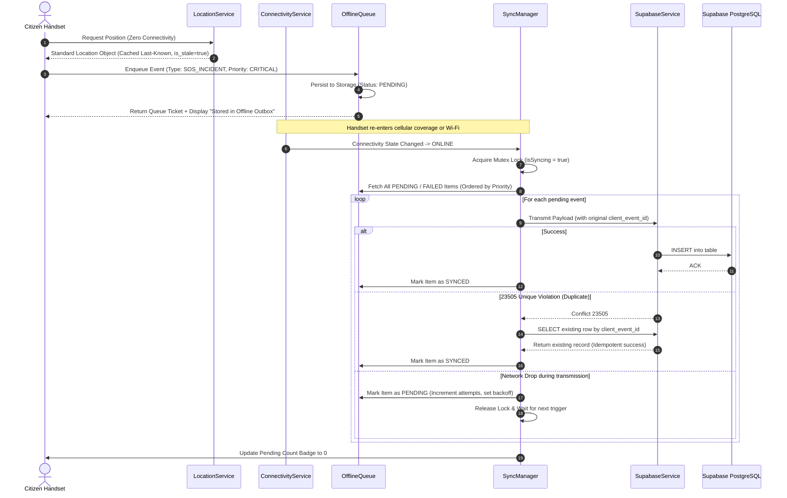
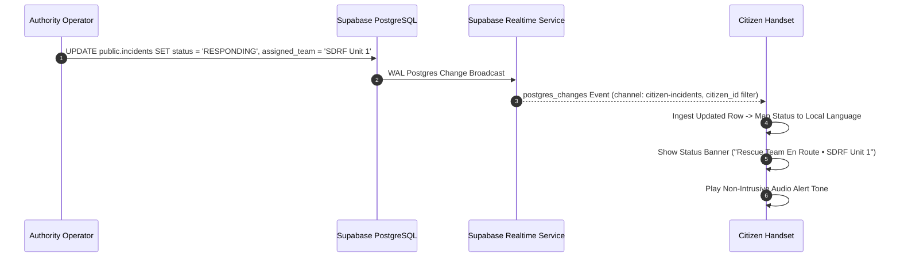
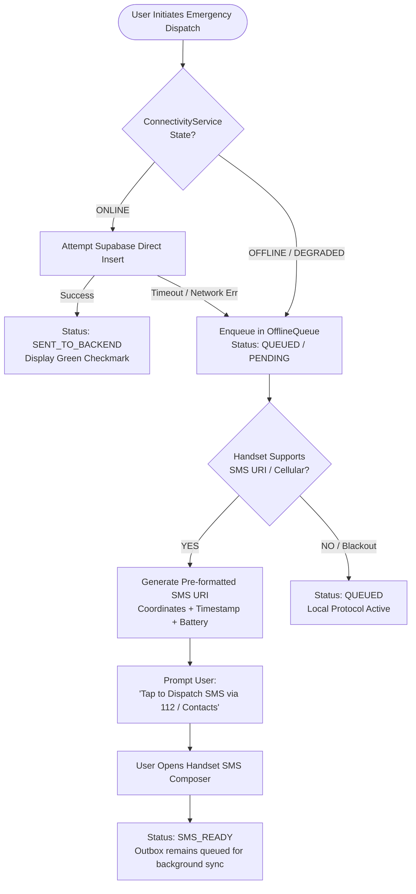
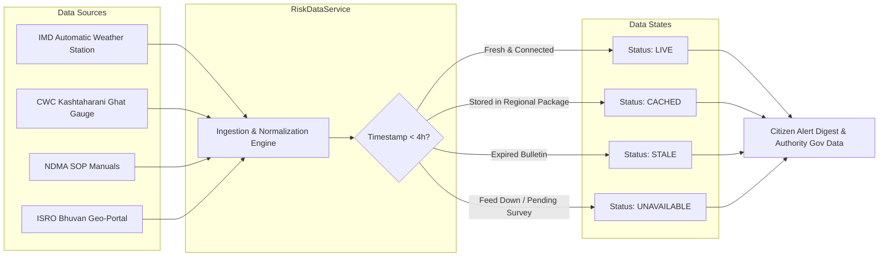
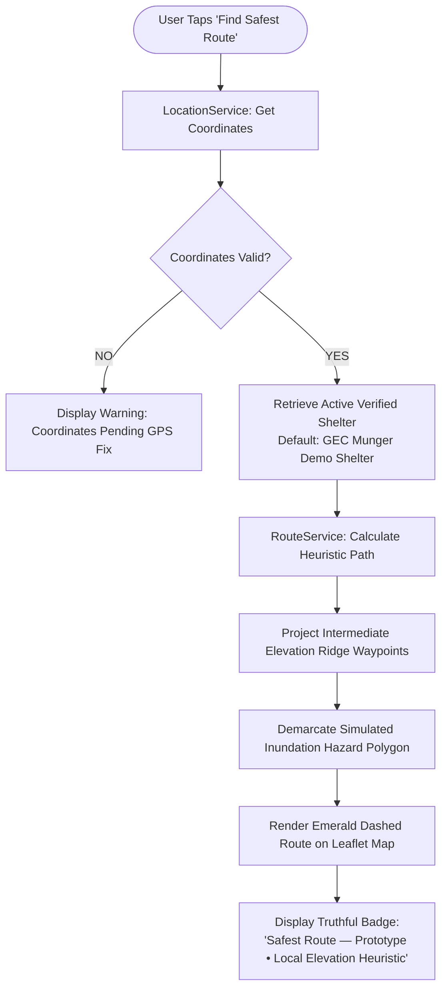
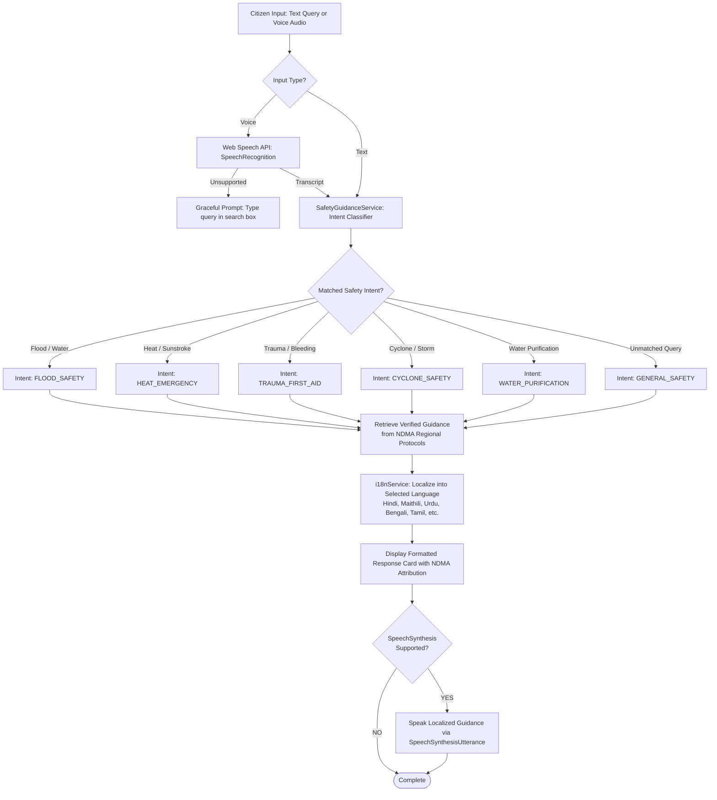

# RakshaSetu Comprehensive Architecture Map

**Project**: RakshaSetu Last-Mile Emergency Disaster-Response Platform  
**System Tier**: Citizen PWA & Authority Emergency Operations Center (EOC)  
**Phase**: Phase 0 — Comprehensive Architecture Inspection & System Mapping  
**Date**: September 2026 (SIH 2026 Production Baseline)

---

## 1. Executive Summary & Architectural Integrity

RakshaSetu is an existing, operational last-mile disaster-response application. It consists of two active web application clients:
1. **Citizen PWA** (`/citizen/`): A progressive offline-first web application designed for disaster victims and rural citizens with 23 scheduled Indian languages + English, RTL layout support (Urdu, Sindhi), one-tap SOS, offline regional safety packages, shelter navigation, and low-data SMS fallbacks.
2. **Authority EOC Console** (`/authority/`): A tactical command dashboard for District Emergency Operations Centers (DEOCs), rescue coordinators, and field supervisors supporting incident triage, rescue team dispatch, live vs. last-known geospatial tracking, and resource logistics.

Both applications share a single cloud source of truth: **Supabase PostgreSQL** with Row-Level Security (RLS) and Realtime change streams.

---

## 2. Current Architecture vs. Target Architecture

### 2.1 Current Architecture Overview

```
                                  +------------------------------+
                                  |    Supabase Cloud Backend    |
                                  | (PostgreSQL + RLS + Realtime)|
                                  +---------------+--------------+
                                                  |
                         +------------------------+-----------------------+
                         |                                                |
                         v                                                v
            +---------------------------+                   +---------------------------+
            |        Citizen PWA        |                   |       Authority EOC       |
            |     (/citizen/index.html) |                   |    (/authority/index.html)|
            +-------------+-------------+                   +-------------+-------------+
                          |                                               |
             [Fragmented Subsystems]                         [Dedicated Subsystems]
             - emergency-sos.js (loc + sos)                  - incidentService.js
             - family-safety.js (im safe + sms)              - resourceService.js
             - safety-map.js (leaflet + route)               - shelterService.js
             - safety-assistant.js (voice + bot)             - heartbeatService.js
             - alerts-manager.js (dam + imd)                 - governmentDataService.js
             - sync-manager.js (sos outbox only)             - authService.js
             - resource-requests.js (separate outbox)        - map.js
             - offline-storage.js (pkg + unlinked IDB)       - state.js
             - network-manager.js (7 tiers)                  - drawer.js & modal.js
             - api-client.js (compat adapter)                - api.js (demo/api toggle)
```

#### Identified Architectural Weaknesses in Current Architecture
1. **Location capture duplication**: `emergency-sos.js` implements `captureLocation()` using `navigator.geolocation` with internal timeout logic, while `safety-map.js`, `store.js`, and `family-safety.js` each access raw coordinates or last-known positions independently without standardized freshness (`is_stale`) or source (`GPS`, `NETWORK`, `CACHED`, `DEMO`) tagging.
2. **Offline queue fragmentation**: `sync-manager.js` processes `store.state.outboxQueue` exclusively for `SOS_INCIDENT`. In parallel, `resource-requests.js` maintains a separate array `store.state.resourceRequests` synced via a distinct helper `syncPendingResourceRequests()`. "I'm Safe" broadcasts (`family-safety.js`) do not use an offline queue at all; when offline, they immediately revert to SMS without queuing to Supabase. Heartbeats fail silently if offline rather than participating in the unified queue.
3. **Safety Guidance & i18n disconnection**: The Citizen PWA has a translation system supporting 23 Indian languages (`citizen/i18n/`). However, `safety-assistant.js` returns hardcoded English strings and hardcoded Odisha shelter references ("Astaranga Ward 4") rather than dynamically querying verified `ndmaSafetyProtocols` from the regional data package and localizing responses via `i18n`.
4. **Hardcoded regional remnants**: `alerts-manager.js` and `safety-map.js` contain legacy references to Coastal Odisha (Hirakud dam, Fani 2019 surge polygon), while the designated primary prototype region is Munger, Bihar (`bihar-munger`).
5. **Duplicate client adapters**: `citizen/js/api-client.js` acts as an HTTP-like abstraction over Supabase, while `authority/src/services/api.js` acts as an abstraction for DEMO/REST fallback.

---

### 2.2 Target Architecture: Shared RakshaSetu Safety Core

```
===================================================================================
                                  RAKSHASETU SYSTEM
===================================================================================
         +-----------------------------+         +-----------------------------+
         |         CITIZEN PWA         |         |        AUTHORITY EOC        |
         |    (Rural-Optimized UI)     |         |     (Tactical Console)      |
         +--------------+--------------+         +--------------+--------------+
                        |                                       |
                        +-------------------+-------------------+
                                            |
                                            v
+=================================================================================+
|                          SHARED SAFETY CORE SERVICES                            |
|                                                                                 |
|   +-----------------------+ +-----------------------+ +---------------------+   |
|   |    LocationService    | |  ConnectivityService  | |    OfflineQueue     |   |
|   |  - High-accuracy GPS  | |  - Online/Offline/Deg | |  - Single outbox    |   |
|   |  - Freshness/Staleness| |  - Network tiering    | |  - Priority triage  |   |
|   |  - Standard source tag| |  - Active health ping | |  - State integrity  |   |
|   +-----------------------+ +-----------------------+ +---------------------+   |
|                                                                                 |
|   +-----------------------+ +-----------------------+ +---------------------+   |
|   |      SyncManager      | |    SupabaseService    | |   RealtimeService   |   |
|   |  - Mutex outbox flush | |  - Centralized client | |  - Channel manager  |   |
|   |  - Idempotent retries | |  - Strict RLS respect | |  - Deduplication    |   |
|   |  - Exp. backoff retry | |  - Public anon key    | |  - Scoped lifecycle |   |
|   +-----------------------+ +-----------------------+ +---------------------+   |
|                                                                                 |
|   +-----------------------+ +-----------------------+ +---------------------+   |
|   |  RegionalDataService  | |    RiskDataService    | |CommunicationFallback|   |
|   |  - Munger/Bihar anchor| |  - IMD/CWC/NDMA cache | |  - Supabase -> Outbox|  |
|   |  - No silent fallbacks| |  - Freshness tags     | |    -> SMS URI       |   |
|   |  - Package validator  | |  - Never fake live    | |  - Honest status    |   |
|   +-----------------------+ +-----------------------+ +---------------------+   |
|                                                                                 |
|   +-----------------------+ +-----------------------+ +---------------------+   |
|   | SafetyGuidanceService | |     RouteService      | |  SatelliteService   |   |
|   |  - Verified NDMA SOPs | |  - Safe shelter path  | |  - ISRO Bhuvan link |   |
|   |  - Intent resolution  | |  - Heuristic ridge    | |  - Coordinate bound |   |
|   |  - Voice-ready text   | |  - Prototype marked   | |  - No fake console  |   |
|   +-----------------------+ +-----------------------+ +---------------------+   |
|                                                                                 |
|   +-----------------------+ +-----------------------+ +---------------------+   |
|   |      i18nService      | |      EventLogger      | |    FeatureState     |   |
|   |  - 23 Indian languages| |  - Structured audits  | |  - Reactive store   |   |
|   |  - RTL (Urdu, Sindhi) | |  - Safe redaction     | |  - Session cache    |   |
|   |  - Zero fake fallback | |  - Diagnostic trace   | |  - Local persistence|   |
|   +-----------------------+ +-----------------------+ +---------------------+   |
+=================================================================================+
                                        |
                                        v
                 +-----------------------------------------------+
                 |       SUPABASE OPERATIONAL DATA LAYER         |
                 | - public.incidents (Distress signals)         |
                 | - public.resource_requests (Logistics items)  |
                 | - public.shelters (Relief centers)            |
                 | - public.heartbeats (Location telemetry)      |
                 | - public.family_safety ("I'm Safe" log)       |
                 | - public.alerts (IMD/CWC bulletins)           |
                 | - public.profiles (Auth & RBAC roles)         |
                 +-----------------------------------------------+
```

---

## 3. Existing Service & File Inventory

| File Path | Role in Current System | Target Mapping in Safety Core | Actions Required |
|:---|:---|:---|:---|
| `citizen/js/app.js` | Main Citizen UI controller, screen navigation, DOM event bindings | Citizen PWA Application Layer | Refactor to consume shared safety services; preserve all 11 screens |
| `citizen/js/store.js` | Global state, local storage persistence, action dispatchers | `FeatureState` | Retain as central state store; extend queue model to support unified outbox |
| `citizen/js/network-manager.js` | 7-tier network state machine, simulation drawer | `ConnectivityService` | Extend with `getState()` returning `ONLINE`, `OFFLINE`, `DEGRADED`, `UNKNOWN`; maintain 7 tiers |
| `citizen/js/emergency-sos.js` | SOS workflow, coordinates capture, SMS generation | Shared across `LocationService`, `CommunicationFallback`, `SyncManager` | Extract location logic to `LocationService`; reuse SOS dispatch logic |
| `citizen/js/offline-storage.js` | Regional package loader, unused IndexedDB init, heartbeat logger | `RegionalDataService` + `OfflineQueue` | Connect package resolver strictly to Munger/Bihar; integrate storage persistence |
| `citizen/js/sync-manager.js` | Outbox loop, Supabase incident insert, 23505 retry | `SyncManager` | Generalize loop to process all queue types (`SOS`, `IM_SAFE`, `HEARTBEAT`, `RESOURCE`) |
| `citizen/js/api-client.js` | Supabase adapter mimicking REST client (`GET`, `POST`, `PATCH`) | `SupabaseService` | Keep compatibility layer; ensure clean method wrappers for tables |
| `citizen/js/supabase-client.js` | Public Supabase client initialization | `SupabaseService` | Single source of Supabase client in citizen app; reuse unchanged |
| `citizen/js/realtime-service.js` | Realtime subscription for citizen incidents and resource requests | `RealtimeService` | Reusable scoped subscription manager; preserve intact |
| `citizen/js/family-safety.js` | Contact management, "I'm Safe" message builder, SMS URI generator | Consumes `CommunicationFallback` & `OfflineQueue` | Route "I'm Safe" through unified outbox + fallback mechanism |
| `citizen/js/safety-map.js` | Leaflet map, shelter markers, heuristic safe route, Bhuvan trigger | Consumes `RouteService` & `SatelliteService` | Delegate routing calculations to `RouteService`; remove hardcoded Odisha coordinates |
| `citizen/js/safety-assistant.js` | Speech recognition, SpeechSynthesis, keyword query matching | Consumes `SafetyGuidanceService` & `i18nService` | Integrate structured intent pipeline and 23-language translated guidance |
| `citizen/js/alerts-manager.js` | IMD/CWC bulletin viewer, dam risk digest | Consumes `RiskDataService` | Replace hardcoded Hirakud Dam fallback with Munger Ganga hydrological telemetry |
| `citizen/js/health-guide.js` | Symptom guide, emergency do's and don'ts | Consumes `SafetyGuidanceService` | Preserved as verified medical guidance component |
| `citizen/js/language-service.js` | Language selection persistence | `i18nService` | Integrates with `citizen/i18n/index.js` |
| `citizen/js/websocket-client.js` | Legacy WebSocket client (disabled in browser) | Legacy stub | Retain stub to prevent breaks; do not invoke |
| `citizen/sw.js` | PWA Service Worker caching offline assets | PWA Infrastructure | Update cache manifest to include shared core modules |
| `citizen/assets/data/regional-packages.json` | JSON dataset of regions and NDMA protocols | `RegionalDataService` asset | Maintain Munger/Bihar package; remove hardcoded defaults to Odisha |
| `authority/src/app.js` | EOC main application orchestrator, tab switcher, KPIs | Authority Application Layer | Preserve intact; already consumes modular services |
| `authority/src/services/supabase-client.js` | Supabase client for Authority EOC | `SupabaseService` | Preserve intact; uses safe anon key |
| `authority/src/services/authService.js` | Authority login & RBAC profile role verification | Authority Security Layer | Preserve intact; strictly verifies `profiles.role IN ('authority', 'admin')` |
| `authority/src/services/incidentService.js` | Incidents data store, triage workflow, assignment modal | Authority Operations Layer | Preserve intact; operational source of truth |
| `authority/src/services/resourceService.js` | Resource requests lifecycle manager | Authority Logistics Layer | Preserve intact; manages `PENDING` -> `ASSIGNED` -> `IN_TRANSIT` -> `DELIVERED` |
| `authority/src/services/shelterService.js` | Shelter management, capacity, Munger demo shelter | Authority Infrastructure Layer | Preserve intact; manages Munger demo shelter |
| `authority/src/services/heartbeatService.js` | Heartbeat query, LIVE/LAST-KNOWN/STALE classifier | Authority Intelligence Layer | Preserve intact; enforces location classification |
| `authority/src/services/governmentDataService.js` | IMD/CWC/NDMA/Bhuvan data repository | Authority Intelligence Layer | Preserve intact; Munger Ganga water level + IMD Red Alert |
| `authority/src/data/govSources.js` | Verified government source definitions | `RiskDataService` reference | Canonical Munger/Bihar government alerts |

---

## 4. Feature-to-Service Mapping Matrix

The 7 target engineering areas map cleanly to the shared services:

```
+-----------------------------------------------------------------------------------+
| TARGET FEATURE AREA                  | CORE SERVICES UTILIZED                     |
+--------------------------------------+--------------------------------------------+
| A. Multilingual Voice + Text Chat    | SafetyGuidanceService, i18nService,        |
|                                      | LocationService, RegionalDataService       |
+--------------------------------------+--------------------------------------------+
| B. "I'm Safe" Broadcast              | CommunicationFallback, OfflineQueue,       |
|                                      | LocationService, SyncManager,              |
|                                      | SupabaseService (family_safety)            |
+--------------------------------------+--------------------------------------------+
| C. Satellite Imagery / Bhuvan        | SatelliteService, RegionalDataService,     |
|                                      | RiskDataService                            |
+--------------------------------------+--------------------------------------------+
| D. Dam & Weather Risk Digest         | RiskDataService, RegionalDataService,      |
|                                      | i18nService, SupabaseService (alerts)      |
+--------------------------------------+--------------------------------------------+
| E. Safe Route to Shelter             | RouteService, LocationService,             |
|                                      | RegionalDataService, SupabaseService       |
+--------------------------------------+--------------------------------------------+
| F. Pre-Blackout Location Heartbeat   | LocationService, ConnectivityService,      |
|                                      | OfflineQueue, SyncManager,                 |
|                                      | SupabaseService (heartbeats)               |
+--------------------------------------+--------------------------------------------+
| G. Low-Data Location Ping / SMS Path | CommunicationFallback, LocationService,    |
|                                      | ConnectivityService                        |
+-----------------------------------------------------------------------------------+
```

---

## 5. Supabase Dependency & Security Map

### 5.1 Tables and Schema Contracts

| Table Name | Operations (Citizen) | Operations (Authority) | Row-Level Security (RLS) Policy Summary |
|:---|:---|:---|:---|
| `public.profiles` | SELECT (own), UPDATE (own) | SELECT (all), UPDATE (admin) | Users can only read and update their own profile (`auth.uid() = id`). Role cannot be self-elevated. |
| `public.incidents` | INSERT (authenticated), SELECT (own `citizen_id`) | SELECT (all), UPDATE (status, assigned_team) | Citizens insert distress beacons with own `citizen_id`. Authority/admin accounts view and triage all. |
| `public.resource_requests` | INSERT (authenticated), SELECT (own `citizen_id`) | SELECT (all), UPDATE (status, team) | Citizens insert relief requests. Authority/admin updates status through `PENDING -> ASSIGNED -> IN_TRANSIT -> DELIVERED`. |
| `public.shelters` | SELECT (all active) | SELECT (all), INSERT/UPDATE/DELETE | `Anyone can view shelters` (SELECT true). INSERT/UPDATE/DELETE restricted to `profiles.role IN ('authority', 'admin')`. |
| `public.heartbeats` | INSERT (authenticated) | SELECT (all telemetry) | Citizens append periodic location fixes. Authority reads telemetry to categorize signal age and accuracy. |
| `public.family_safety` | INSERT (authenticated), SELECT (own) | N/A (citizen private) | Citizens record broadcast confirmation. Scoped strictly to `auth.uid() = citizen_id`. |
| `public.alerts` | SELECT (active = true) | SELECT (all), INSERT/UPDATE | Read-only for general public/citizens. Managed by administrators or official automated ingest. |
| `public.rescue_teams` | SELECT (assigned only) | SELECT (all), UPDATE (status) | Rescue unit operational registry. Dispatched exclusively by EOC operators. |

### 5.2 Stored Procedures & RPCs
- `public.ingest_authority_demo_incident`: `SECURITY DEFINER` function allowing authorized authority accounts to insert simulated SOS incidents with valid `client_event_id` and Munger coordinates without exposing service credentials.

---

## 6. End-to-End Data Flow Architectures

### 6.1 Online Data Flow



---

### 6.2 Offline Data Flow & Recovery Sync



---

### 6.3 Realtime Data Flow



---

### 6.4 Communication Fallback Flow



---

### 6.5 Risk Data & Telemetry Flow



---

### 6.6 Safe Route to Shelter Flow



---

### 6.7 Voice & Text Multilingual Safety Guidance Flow



---

## 7. Technical Risk Analysis & Guardrails

1. **Authentication Integrity**:
   - Citizen authentication uses email + password or passwordless session.
   - Authority authentication strictly verifies `profiles.role IN ('authority', 'admin')` from the database. No client-side URL or localStorage role tampering can grant EOC access.
2. **Offline Resilience without Background Sync**:
   - While modern browsers support the Background Sync API, iOS Safari and certain low-end Android browsers do not.
   - Guardrail: Foreground re-connection listeners (`window.online`, `visibilitychange`, and periodic interval timers) guarantee zero-data-loss synchronization regardless of Background Sync API support.
3. **Idempotency & Race Condition Prevention**:
   - Every distress beacon is assigned a persistent RFC4122 UUID `client_event_id` upon creation before any network attempt.
   - Database unique constraint on `client_event_id` (PostgreSQL error code 23505) triggers automatic resolution of existing records instead of generating duplicate distress tickets.
4. **Data Truthfulness**:
   - The platform never presents local heuristic routes as certified emergency evacuation corridors.
   - The platform never presents cached government data as live real-time sensors.
   - Satellite integration is maintained as an external link launcher to the official ISRO NRSC Bhuvan Disaster Management Support Portal.
